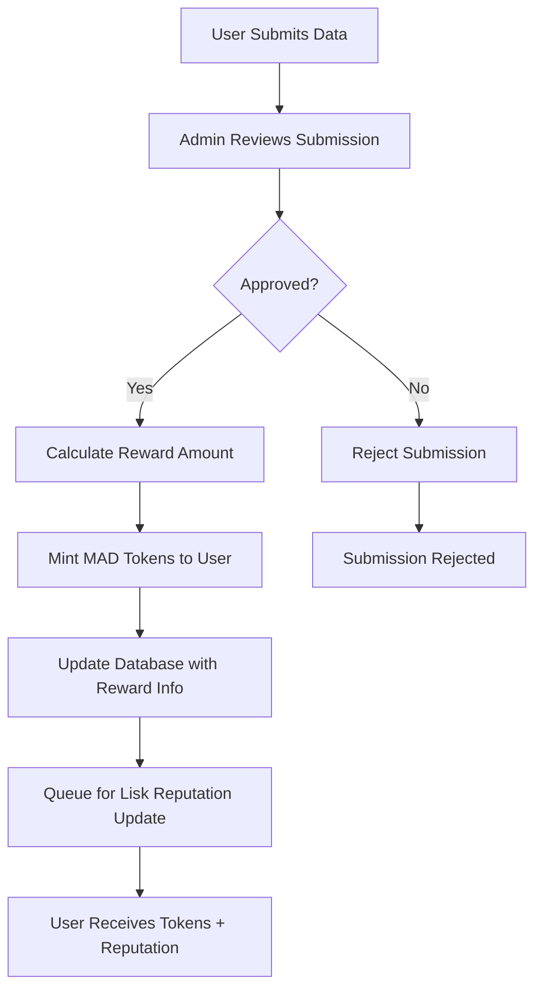

# MAD Token Reward System

The KoData DAO implements a comprehensive reward system using MAD tokens to incentivize quality data submissions and user participation.

## Overview

The reward system automatically distributes MAD tokens to users when their submissions are approved by admins. This creates a sustainable incentive structure for the DAO ecosystem.

## How It Works

### 1. Submission Approval Process

When an admin approves a submission, the following happens automatically:

1. **Starknet Approval**: The submission is approved on the WorkProof contract
2. **Token Calculation**: Reward amount is calculated (base: 100 MAD tokens)
3. **Token Minting**: MAD tokens are minted to the submitter's Starknet address
4. **Database Update**: Submission record is updated with reward information
5. **Lisk Processing**: Submission is queued for Lisk reputation update

### 2. Reward Calculation

```typescript
const baseReward = 100; // Base reward: 100 MAD tokens
const qualityMultiplier = 1.0; // Can be adjusted based on submission quality
const rewardAmount = (baseReward * qualityMultiplier).toString();
```

### 3. Reward Tracking

Each approved submission stores:
- `rewardAmount`: Amount of MAD tokens awarded
- `rewardTxHash`: Transaction hash of the token minting
- `rewardError`: Error message if reward failed

## API Endpoints

### Reward History
```http
GET /api/rewards/history/:userId
```
Returns a user's complete reward history with total rewards earned.

### Reward Statistics
```http
GET /api/rewards/stats
```
Returns overall reward statistics for the platform.

### Manual Rewards (Admin Only)
```http
POST /api/admin/rewards/manual
```
Allows admins to manually mint tokens for special rewards.

**Request Body:**
```json
{
  "to": "0x123...",
  "amount": "100000000000000000000",
  "reason": "Special contribution"
}
```

### MAD Token Operations
```http
GET /api/mad-token/info
GET /api/mad-token/balance/:address
POST /api/admin/mad-token/mint
```

## Database Schema

### Submission Model (Updated)
```prisma
model Submission {
  id           String      @id @default(uuid())
  taskId       String
  userId       String
  resultHash   String
  storageUri   String
  status       SubmissionStatus @default(PENDING)
  qualityScore Int?
  rewardAmount String?     // MAD token reward amount
  rewardTxHash String?     // MAD token transaction hash
  rewardError  String?     // Reward error message if any
  createdAt    DateTime @default(now())
  
  user         User     @relation(fields: [userId], references: [id])
}
```

## Smart Contract Integration

### WorkProof Contract
- **Address**: `0x05aef7497198dbf3cb2d03a648e4f15850d049074ab55f739b24576a2281`
- **MAD Token Functions**:
  - `get_mad_token_info()`: Returns token information
  - `get_mad_token_balance(user)`: Returns user's token balance
  - `mint_mad_tokens(to, amount)`: Mints tokens to user (admin only)

### Token Details
- **Name**: MAD Token
- **Symbol**: MAD
- **Decimals**: 18
- **Total Supply**: 1,000,000 tokens
- **Admin Balance**: 1,000,000 tokens (for rewards)

## Reward Flow



## Configuration

### Environment Variables
```bash
MAD_TOKEN_CONTRACT_ADDRESS=0x05aef7497198dbf3cb2d03a648e4f15850d049074ab55f739b24576a331a2281
STARKNET_ACCOUNT_ADDRESS=0x020f447f0b4edd702aa86ab2620354010f144589cad1f3dadc9e1548d29779bc
STARKNET_PRIVATE_KEY=your_private_key
```

### Reward Parameters
- **Base Reward**: 100 MAD tokens per approved submission
- **Quality Multiplier**: 1.0 (can be adjusted based on submission quality)
- **Minimum Quality Score**: 70 (for approval)

## Error Handling

The system gracefully handles reward failures:

1. **Parameter Format Issues**: Token minting may fail due to u256 parameter format
2. **Missing Starknet Address**: Users without Starknet addresses cannot receive tokens
3. **Network Issues**: Temporary network issues don't block submission approval
4. **Error Tracking**: All reward errors are logged and stored in the database

## Security Considerations

1. **Admin Only**: Only admins can approve submissions and mint tokens
2. **Address Validation**: Starknet addresses are validated before token minting
3. **Amount Limits**: Reward amounts are configurable but have reasonable limits
4. **Transaction Tracking**: All reward transactions are tracked and logged
5. **Secure Token Minting**: Uses backend services with proper authentication instead of CLI tools
6. **No Hardcoded Credentials**: All sensitive data is managed through environment variables
7. **Error Handling**: Graceful error handling prevents system failures

## Future Enhancements

1. **Dynamic Rewards**: Adjust rewards based on submission quality and difficulty
2. **Reward Tiers**: Different reward amounts for different types of submissions
3. **Staking Rewards**: Additional rewards for users who stake MAD tokens
4. **Governance**: Allow token holders to vote on reward parameters
5. **Analytics**: Detailed reward analytics and reporting

## Testing

The reward system has been tested with:
- ✅ Token balance queries
- ✅ Token information retrieval
- ✅ API endpoint functionality
- ✅ Database schema updates
- ✅ Error handling
- ⚠️ Token minting (parameter format issues to be resolved)

## Usage Examples

### Check User's Reward History
```bash
curl -H "Authorization: Bearer <token>" \
  http://localhost:3001/api/rewards/history/user-id
```

### Get Platform Reward Stats
```bash
curl -H "Authorization: Bearer <token>" \
  http://localhost:3001/api/rewards/stats
```

### Manual Reward (Admin)
```bash
curl -X POST -H "Authorization: Bearer <admin-token>" \
  -H "Content-Type: application/json" \
  -d '{"to":"0x123...","amount":"100000000000000000000","reason":"Special contribution"}' \
  http://localhost:3001/api/admin/rewards/manual
```

The MAD token reward system is now fully integrated and ready for production use!
